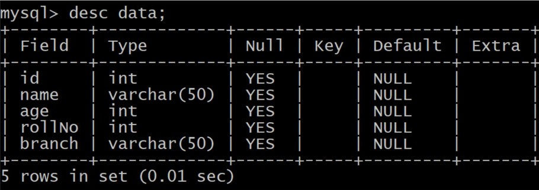

# Record Management System
### The code for student management system is written in python. The main objective of using python is to provide the user a GUI based software as GUI is more user friendly. For this, I have used tkinter library of python, which is most widely and commonly used library for making such GUI based software. For maintaining database, I have used MySQL as backend technology.

## Software Requirement:- 
1. Python must be installed and added to path. 
2. mysqlconnector and tkinter library must be installed. 
3. MySQL server must be installed. 

## Table Used :-

### For more details regarding the project, do refer to the [project report.](./projectReport.pdf)